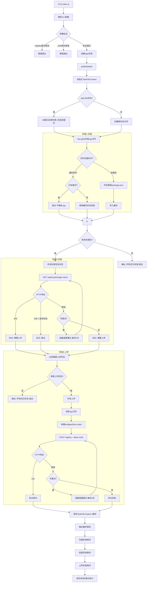

# npm包发布工具

基于TypeScript和Deno构建的npm包发布工具，专注于将npm包发布到私有仓库。经过优化，现在支持高性能文件扫描、单包存在性检查和现代HTTP客户端。

## 环境要求

- [Deno](https://deno.land/) 1.40+ 
- 支持的操作系统：Windows、Linux、macOS

> ！！！已停止维护！！！由于需要适配npm/yarn/pnpm等众多工具，尤其是pnpm难度较大，停用此方案。
> 替代方案：
> - 在线环境部署`Verdaccio`
> - 设置registry指向本地服务，然后使用任何包管理工具安装依赖
> - 拷贝`Verdaccio`的storage目录到离线环境，通过`Verdaccio`重新发布

## 安装和构建

```bash
# 开发模式运行
deno task dev

# 直接运行
deno task start

# 代码检查（lint + 类型检查）
deno task check

# 构建可执行文件
deno task build

# 清理构建产物
deno task clean
```

### 构建说明

- **`deno task build`**: 使用Deno编译器构建，生成单个可执行文件（`dist/pu.exe`）
- 构建产物为原生可执行文件，无需安装Deno运行时即可运行
- 支持Windows x64平台，可根据需要修改target参数支持其他平台

### 技术实现

项目使用现代化的Deno技术栈：
- **TypeScript原生支持**: 无需额外编译步骤，直接运行.ts文件
- **路径别名**: `@/*`映射到`src/*`，简化模块导入
- **原生可执行文件**: 使用`deno compile`打包为独立可执行文件
- **严格类型检查**: 启用所有TypeScript严格模式选项
- **现代ES模块**: 使用ESNext模块系统和import/export语法
- **内置工具链**: 集成格式化、lint、测试等开发工具

### 开发工作流

```bash
# 代码格式化
deno task format

# 代码检查
deno task lint

# 类型检查
deno task typecheck

# 运行测试
deno task test

# 完整检查（推荐在提交前运行）
deno task check
```

## 使用方法

```bash
> pu.exe --help

Options:
      --version     Show version number                                                    [boolean]
  -d, --dir         Directory with packages to publish                [string] [required]
  -r, --registry    Repository registry (format: ${baseURL}/repository/{repository}/)    [string] [required]
  -a, --auth        Repository auth (username:password)                          [string] [required]
  -t, --threads     Concurrent threads                                         [number] [default: 1]
  -l, --log-level   Log level (debug, info, warn, error)               [string] [choices: "debug", "info", "warn", "error"] [default: "info"]
  -f, --task-file   Task file path for tracking processed packages (enables resume support)  [string]
      --help        Show help                                                              [boolean]
```

### 新特性说明

- **移除了 `--force` 参数**: 新版本自动为每个包进行单独的存在性检查，无需强制发布模式
- **智能文件扫描**: 使用fast-glob库进行高性能递归文件扫描
- **精确包信息提取**: 从.tgz文件内的package.json提取准确的包名和版本信息
- **单包存在性检查**: 替代全量仓库扫描，大幅提升检查效率
- **认证支持**: 检查和上传阶段均携带Basic Auth认证头
- **自动重试**: 网络错误、超时等临时性故障自动重试（指数退避，最多3次）
- **断点续传**: 使用 `-f` 参数记录已处理的包，中断后重跑可跳过已处理的包
- **统一错误处理**: 错误自动分类、统计，敏感信息脱敏

### 使用示例

```bash
# 基本用法 - 发布packages目录下的所有.tgz文件
pu.exe -d packages -r http://localhost:8081/repository/npm/ -a username:password

# 使用多线程并发上传
pu.exe -d packages -r https://nexus.example.com/repository/npm-hosted/ -a username:password -t 5

# 发布指定目录及其子目录中的所有包
pu.exe -d dist -r https://nexus.example.com/repository/npm-internal/ -a username:password -t 3

# 启用断点续传（中断后重跑会跳过已上传的包）
pu.exe -d packages -r http://localhost:8081/repository/npm/ -a username:password -t 4 -f .publish-task.json

# 调试模式（输出详细日志）
pu.exe -d packages -r http://localhost:8081/repository/npm/ -a username:password -l debug
```

## 处理流程



### 流程说明

| 阶段 | 操作 | 并发控制 | 超时 | 重试 |
|------|------|---------|------|------|
| 扫描 | fast-glob 递归扫描 `.tgz` → tar 解析 `package.json` | `min(threads, 10)` | 30s/文件 | 无 |
| 检查 | `GET /repository/{repo}/{name}` → 检查版本是否存在 | `threads` | 30s/请求 | 最多3次，指数退避 |
| 上传 | `POST /service/rest/v1/components?repository={repo}` + Basic Auth | `threads` | 5min/请求 | 最多3次，指数退避 |

### 错误重试策略

网络错误、超时、服务器错误(5xx) 等临时性故障会自动重试，采用**指数退避 + 随机抖动**：

| 尝试 | 延迟范围 |
|------|---------|
| 第1次重试 | 750ms ~ 1000ms |
| 第2次重试 | 1500ms ~ 2000ms |
| 第3次重试 | 3000ms ~ 4000ms |

认证错误(401)、权限错误(403)、文件不存在等永久性故障**不重试**，直接标记失败。

### 断点续传

使用 `-f` 参数指定任务文件路径后，工具会：

1. **首次运行**：创建任务文件，记录每个成功上传的包及其文件路径对应的包信息缓存
2. **中断后重跑**：加载任务文件，**跳过已处理的包且不解析其 .tgz 文件**，只对未处理的包执行 tar 解析
3. **全部完成**：任务文件包含所有已处理包的完整记录和包信息缓存

任务文件格式示例：
```json
{
  "version": "1.0.0",
  "createdAt": "2026-05-09T12:00:00.000Z",
  "updatedAt": "2026-05-09T12:05:30.000Z",
  "processedPackages": [
    "my-package@1.0.0",
    "@scope/pkg@2.1.0"
  ],
  "packageCache": {
    "D:\\npm\\.Verdaccio\\my-package-1.0.0.tgz": {
      "filePath": "D:\\npm\\.Verdaccio\\my-package-1.0.0.tgz",
      "fileName": "my-package-1.0.0.tgz",
      "packageName": "my-package",
      "version": "1.0.0"
    }
  }
}
```

> **性能提示**: `packageCache` 字段缓存了文件路径到包信息的映射，避免重复解析 .tgz 文件。
> 在 USB 2.0 等慢速存储环境下，这可以将恢复速度提升数十倍。

### Registry URL格式说明

Registry URL必须符合以下格式：`${BASEURL}/repository/{repository}/`

**示例：**
- 输入：`http://localhost:8081/repository/npm/`
- 解析结果：
  - `baseURL`: `http://localhost:8081/`
  - `repository`: `npm`
  - 上传URL: `http://localhost:8081/service/rest/v1/components?repository=npm`

**支持的格式：**
- `http://localhost:8081/repository/npm/`
- `https://nexus.company.com/repository/npm-public/`
- `https://nexus.company.com:8443/repository/npm-internal/`

### 工作流程

1. **文件扫描**: 使用fast-glob递归扫描指定目录下的所有.tgz文件
2. **缓存过滤**: 检查任务文件缓存，已处理的包直接跳过（不解析.tgz），未处理但有缓存的直接使用缓存信息
3. **包信息提取**: 仅对未缓存的.tgz文件执行tar解析，并将结果写入缓存
4. **存在性检查**: 并发检查每个包是否已存在于远程仓库（携带认证，带重试）
5. **智能上传**: 只上传不存在或版本不同的包（携带认证，带重试）
6. **记录进度**: 更新任务文件，记录成功上传的包和包信息缓存
7. **结果报告**: 提供详细的成功/失败统计和各阶段耗时

## 已知问题

### 上传文件损坏

现象：少数包在内网仓库发布后会损坏，表现为拉取时提示`seems to be corrupted`。

原因：不详。

解决方法：首先确认上传的包是否存在问题，确认无误后通过web管理端手动上传。

## 技术栈

- **运行时**: Deno 1.40+
- **语言**: TypeScript (严格模式)
- **构建工具**: Deno compile
- **代码规范**: Deno fmt + Deno lint
- **依赖管理**: Deno原生支持，通过deno.json配置

### 主要依赖

- **chalk**: 终端颜色输出
- **fast-glob**: 高性能文件扫描
- **cli-progress**: 进度条显示
- **tar**: .tgz文件解析
- **yargs**: 命令行参数解析

所有依赖通过npm:前缀从npm仓库导入，无需额外的包管理器。

## 为什么选择Deno？

- **安全性**: 默认安全，需要显式授权文件、网络等权限
- **现代化**: 原生支持TypeScript、ES模块、Web标准API
- **简单性**: 无需package.json、node_modules，依赖管理更简洁
- **性能**: 基于V8和Rust构建，启动速度快，内存占用低
- **工具链**: 内置格式化、lint、测试、打包等工具
- **兼容性**: 支持npm包，可以无缝使用现有生态

## 项目结构

```
src/
├── index.ts               # 应用入口点
├── core/                  # 核心业务逻辑
│   ├── cli.ts            # CLI参数处理
│   └── app.ts            # 应用主逻辑
├── services/              # 业务服务层
│   ├── package-manager.ts        # 包管理器（协调扫描→检查→上传）
│   ├── package-scanner.ts        # 包扫描器（fast-glob）
│   ├── package-checker.ts        # 包检查器（带认证+重试）
│   ├── package-uploader.ts       # 包上传器（带重试）
│   ├── package-info-extractor.ts # 包信息提取器（tar解析）
│   ├── progress-tracker.ts       # 进度跟踪器
│   └── task-file-tracker.ts      # 任务文件跟踪器（断点续传）
├── utils/                 # 工具函数
│   ├── logger.ts              # 日志工具（颜色支持）
│   ├── error-handler.ts       # 错误处理+分类+统计
│   ├── retry.ts               # 重试工具（指数退避）
│   ├── progress-bar.ts        # 进度条工具
│   ├── progress-logger.ts     # 进度条日志适配器
│   ├── registry-url-parser.ts # 仓库URL解析工具
│   └── task.ts                # 并发任务工具
└── types/                 # TypeScript类型定义
    └── index.ts           # 统一类型导出
```

## 功能特性

### 核心功能
- [x] 支持发布到nexus仓库
  - [x] 智能跳过远端仓库已有的包
  - [x] 支持并发发布控制
  - [x] 单包存在性检查（替代全量扫描）
  - [x] 检查和上传阶段均支持认证
- [x] TypeScript支持
  - [x] 完整的类型安全
  - [x] 模块化架构设计
  - [x] 使用Deno运行时

### 性能优化
- [x] **高性能文件扫描**: 使用fast-glob库，支持递归扫描和模式匹配
- [x] **精确包信息提取**: 从.tgz文件内的package.json解析包名和版本
- [x] **单包存在性检查**: 避免全量仓库扫描，大幅提升检查效率
- [x] **现代HTTP客户端**: 使用fetch API替代curl，提供更好的错误处理
- [x] **智能并发控制**: 支持扫描、检查、上传的独立并发控制

### 错误处理和日志
- [x] **详细错误分类**: 网络错误、认证错误、文件错误等分类处理
- [x] **自动重试机制**: 网络错误、超时等临时性故障自动重试（指数退避+抖动）
- [x] **统一错误处理**: ErrorHandler/ErrorClassifier 集中管理错误创建和分类
- [x] **敏感信息脱敏**: URL中的认证信息、token等自动脱敏
- [x] **结构化日志记录**: 支持不同日志级别和敏感信息过滤
- [x] **实时进度跟踪**: 提供扫描、检查、上传各阶段的进度反馈
- [x] **操作结果统计**: 详细的成功/失败统计和错误报告

### 可靠性
- [x] **断点续传**: 使用任务文件记录已处理的包，中断后可恢复
- [x] **认证一致性**: 检查和上传阶段均携带认证信息
- [x] **优雅退出**: 支持SIGINT/SIGTERM信号处理

## 性能对比

| 功能         | 旧版本                | 新版本           | 改进             |
| ------------ | --------------------- | ---------------- | ---------------- |
| 文件扫描     | fs.readdirSync (同步) | fast-glob (异步) | 性能提升50-80%   |
| 包存在性检查 | 全量仓库扫描          | 单包检查         | 速度提升2-5倍    |
| HTTP请求     | curl命令              | fetch API        | 更好的错误处理   |
| 并发控制     | 简单队列              | 智能调度         | 更高效的资源利用 |

> **注意**: 新版本移除了全量仓库扫描功能，每个包都会进行独立的存在性检查。
> 这大幅提升了性能，特别是在处理大型仓库时。对于包含7000+包的仓库，
> 检查时间从约2分钟缩短到几秒钟。
